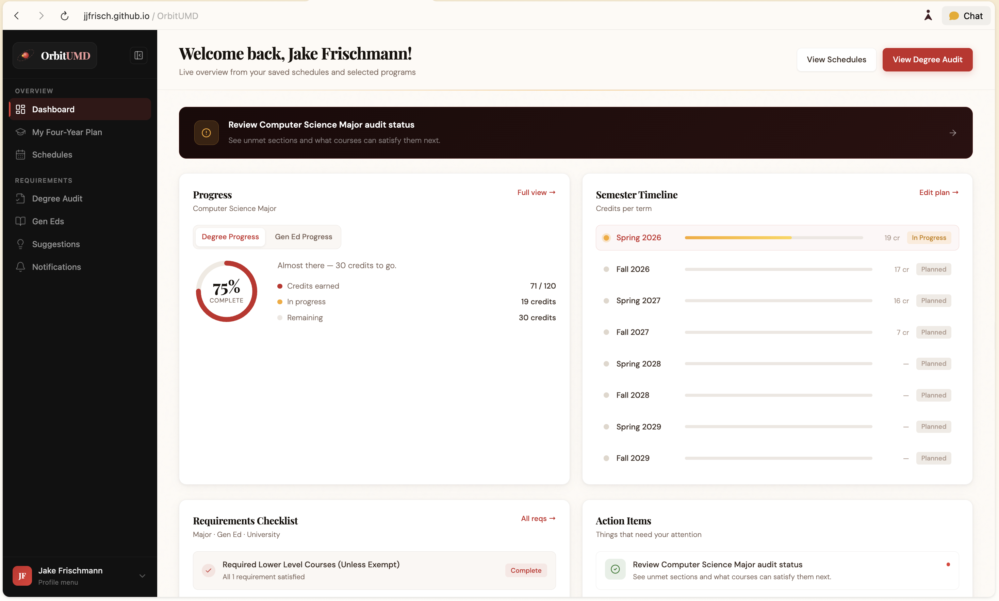
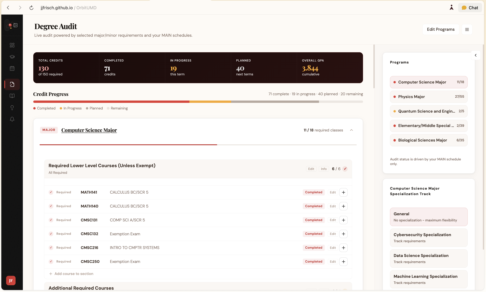
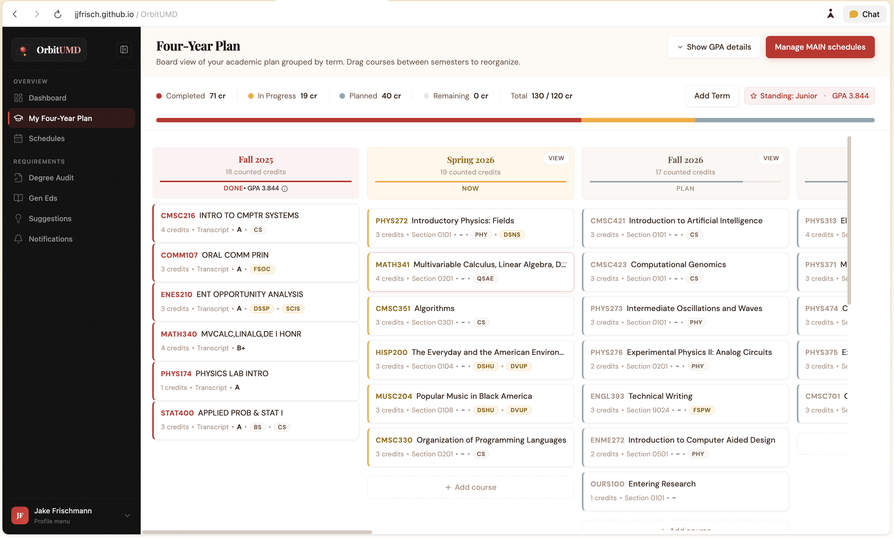

# OrbitUMD

	

Academic planning infrastructure for modern colleges and universities.

OrbitUMD helps institutions deliver a clearer, more connected planning experience with a focus on advisor efficiency and measurable institutional ROI.

	<a href="https://jjfrisch.github.io/OrbitUMD/" target="_blank" rel="noopener noreferrer">Live Preview</a>
	 | 
	<a href="docs/assets/demo-video.mov" target="_blank" rel="noopener noreferrer">Demo Video</a>

## Overview

OrbitUMD unifies the planning workflows institutions depend on every term:

- Conflict-aware schedule building
- Degree and requirement progress visibility
- Multi-term and four-year planning
- Tracking across majors, minors, and Gen Ed pathways

The outcome is straightforward: less advising friction, stronger student planning quality, and scalable support as enrollment grows.

## Why OrbitUMD

### For Advising Teams

- Run faster sessions with clearer student context
- Spend less time manually cross-checking requirements
- Shift toward proactive, pathway-informed conversations
- Improve continuity between advising touchpoints

### For Institutional Leadership

- Increase advising throughput without matching staffing growth
- Reduce time-to-plan for student schedules and pathways
- Support retention and on-time graduation goals
- Lower operational friction from fragmented planning tools

## Core Capabilities

| Capability | What It Enables |
| --- | --- |
| Schedule Planning | Detect and resolve conflicts before registration issues escalate |
| Long-Range Planning | Guide students semester by semester through degree milestones |
| Requirement Tracking | Visualize completion status across programs and Gen Ed requirements |
| Advisor Visibility | Surface pathway context and potential risks earlier |
| Deployment Readiness | Support institution-ready implementation and integrations |

## Demo and Screenshots

Demo video:

[Watch the product walkthrough](docs/assets/demo-video.mov)

## ROI Measurement Framework

Institutions can evaluate impact with a before/after baseline using metrics such as:

- Average advising session duration
- Students advised per advisor per term
- Percent of students with complete multi-term plans
- Registration issue rates (conflicts and unmet requirements)
- Term-to-term retention and graduation velocity indicators

## Pilot Engagement Model

1. Discovery: align on advising workflows, data environment, and success metrics
2. Pilot: run a scoped rollout with advisor teams and KPI baseline tracking
3. Evaluation: compare advisor efficiency and ROI against baseline
4. Scale-Up: plan broader institutional deployment

## Product Status

OrbitUMD is actively developed.

Licensing and source code access are restricted. This repository is for product information only.

## Partnerships and Licensing

OrbitUMD is available through commercial licensing and institutional partnerships.

For demos, pilot discussions, or licensing inquiries:

- Email: jjfrisch@outlook.com
- Website: https://jakefrischmann.me

## FAQ

### Is the source code public?

No. OrbitUMD source code is proprietary.

### Can our institution run a pilot?

Yes. Reach out to discuss pilot scope, timeline, and onboarding.

### Can OrbitUMD integrate with our existing systems?

Integration options can be scoped during discovery based on your SIS, advising stack, and security requirements.

## About

Built by Jake Frischmann.
